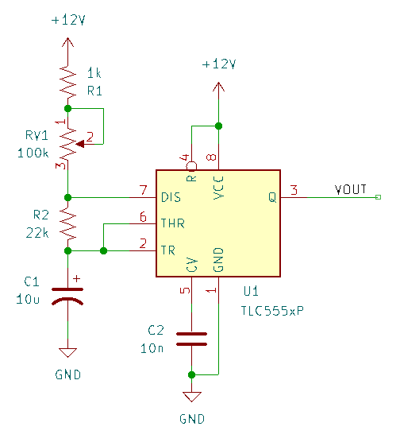
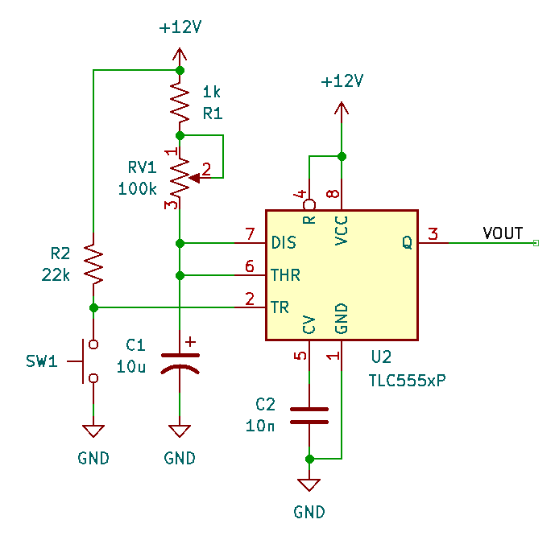
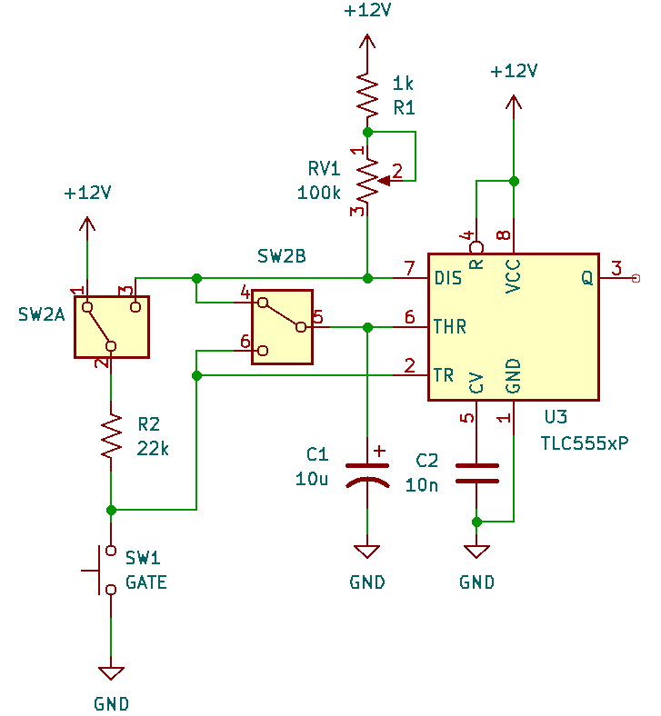

Theory of Operation
===================

The 555 timer can be configured in both monostable (one-shot) and as an oscillator. 

Online calculator: https://www.build-electronic-circuits.com/circuit-calculator-conversion/555-timer-calculator/

Oscillator (Astable)
--------------------

In the astable configuration, 

.. math::

    T_{hi} &= 0.693(R_1 + R_2)C_1 \\ 
    T_{lo} &= 0.693 R_2 C_1 \\
    d_{hi} &= \frac{T_{hi}}{T_{hi} + T_{lo}} = \frac{R_1 + R_2}{R_1 + 2R_2}\\  
    f &= \frac{1.44}{(R_1 + 2R_2)C_1}

In the schematic below, :math:`R_1 \equiv R1 + RV1`, which ranges from 1k to 101k. :math:`R_2=22k\Omega` and :math:`C_1=10\mu F`.

====== ====== ========
R1 (k) f (Hz) duty (%)
====== ====== ========
1      3.2 Hz 52 %      
50     1.5    77
100    1.0    85 
====== ====== ========

The frequency scales inversely with :math:`C_1`: doubling :math:`C_1` will half the frequency.

One-Shot (Monostable)
---------------------

In the monostable/one-shot configuration, a pulse that pulls TRIGGER low resets the timer by discharging :math:`C_1` via the DISCHARGE pin. This sets the output HI until :math:`C_1` charges again through :math:`R_1` and its voltage rises above the timer's threshold. 

.. math::

    T_{pulse} = 1.1 R_1 C_1

In the schematic below, :math:`R_1 \equiv R1 + RV1`, which ranges from 1k to 101k, and :math:`C_1=10\mu F`. The pulse time can be adjusted from 11ms to 1.1s.

Selecting the Operating Mode
----------------------------

Comparing the two schematics above, we can see that switching between the two configurations involves

* connecting THR to TR (astable) or DIS (monostable)
* connecting :math:`R_2` to DIS (astable) or to +V

In the later case, the pull-down switch is still connected to TR, and can act as a sync. A DPDT toggle switch is used.

